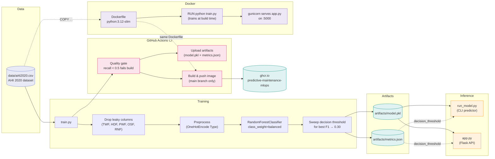

# Predictive Maintenance MLOps 🔧📈

*Building a minimal but real MLOps loop end to end.*

This repo trains a machine-failure classifier on industrial sensor data and
wires it into a full **train → validate → serve → containerize → publish**
pipeline, gated end to end by CI. It's deliberately small in scope so the
*plumbing* stays visible — the interesting part isn't the model, it's
everything around it.

---

## Pipeline overview



`train.py` is the single source of truth: it produces both the model and the
decision threshold used everywhere downstream, so the CLI and the API never
silently disagree with each other or with the reported metrics.

---

## Why this dataset instead of Iris

Iris is 150 rows, perfectly balanced, 4 clean features — it exercises the
plumbing but requires zero ML judgment. AI4I 2020 is ~10,000 rows of
synthetic industrial sensor readings (temperature, torque, rotational speed,
tool wear) with a **binary machine-failure label at a ~3.4% positive rate**.
That forces real decisions instead of a dataset swap in name only:

| Problem | What happens if ignored | How this repo handles it |
|---|---|---|
| **Leakage** | Five sub-flags (`TWF`, `HDF`, `PWF`, `OSF`, `RNF`) directly encode the target — any one being `1` means `Machine failure` is `1`. | Dropped before training in [`train.py`](train.py). |
| **Class imbalance** | At 3.4% positive, always predicting "no failure" scores ~97% accuracy while catching nothing. | `class_weight="balanced"`; `metrics.json` reports precision/recall/F1/ROC-AUC/PR-AUC, with accuracy kept for reference only. |
| **Decision threshold** | The default 0.5 cutoff gives 91% precision but only 46% recall — missing more than half the real failures. | `train.py` sweeps thresholds and picks **0.30**, balancing to ~75% precision / ~71% recall. Saved in `metrics.json`, loaded by both `run_model.py` and `app.py`. |
| **Silent regressions** | A retrain could quietly ship a worse model. | CI fails the build if recall on the held-out set drops below 0.5. |

---

## Project layout

```
.github/workflows/ci.yaml  # train -> quality gate -> build & push image to ghcr
data/ai4i2020.csv          # AI4I 2020 dataset (UCI ML Repository)
train.py                   # trains the model, writes artifacts/
run_model.py                # CLI predictor
app.py                      # Flask API (/health, /predict)
Dockerfile                  # trains at build time, serves via gunicorn
requirements.txt
```

---

## Quick start (local)

```bash
python -m venv .venv && source .venv/bin/activate
pip install -r requirements.txt

python train.py
# Saved artifacts/model.pkl
# {
#   "decision_threshold": 0.3,
#   "accuracy": 0.982,
#   "precision": 0.75,
#   "recall": 0.7059,
#   "f1": 0.7273,
#   "roc_auc": 0.9585,
#   "pr_auc": 0.7745,
#   ...
# }

python run_model.py --type L --air-temp 302 --process-temp 311 \
  --rpm 1350 --torque 65 --tool-wear 220
# Machine failure: YES (threshold=0.3)
# Failure probability: 0.8567

python app.py
# in another terminal:
curl -X POST http://127.0.0.1:5000/predict \
  -H "Content-Type: application/json" \
  -d '{"type":"L","air_temp":302,"process_temp":311,"rpm":1350,"torque":65,"tool_wear":220}'
```

### API reference

| Endpoint | Method | Body | Response |
|---|---|---|---|
| `/health` | GET | — | `{"status": "ok"}` |
| `/predict` | POST | `{"type","air_temp","process_temp","rpm","torque","tool_wear"}` | `{"machine_failure","failure_probability","decision_threshold"}` |

---

## Docker

```bash
docker build -t predictive-maintenance-mlops .
docker run -p 5000:5000 predictive-maintenance-mlops

# in another terminal:
curl -X POST http://127.0.0.1:5000/predict \
  -H "Content-Type: application/json" \
  -d '{"type":"L","air_temp":302,"process_temp":311,"rpm":1350,"torque":65,"tool_wear":220}'
```

The image trains the model at build time (`RUN python train.py`) so it
ships ready to serve — no separate artifact-download step. In a real
deployment you'd instead pull a pre-trained `artifacts/model.pkl` from a
registry (S3, Artifactory) and `COPY` it in, rather than retraining inside
the image build. The container serves via `gunicorn` instead of Flask's
dev server (`python app.py`), which is what production actually runs.

### Pull the published image

Every push to `main` builds this same `Dockerfile` in CI and publishes it to
GitHub Container Registry — no local build required:

```bash
docker pull ghcr.io/im-sathiyan-baskaran/predictive-maintenance-mlops:latest
docker run -p 5000:5000 ghcr.io/im-sathiyan-baskaran/predictive-maintenance-mlops:latest
```

Images are tagged `latest` and with the short commit SHA (`sha-xxxxxxx`),
so a specific build is always pinnable instead of trusting a moving tag.

---

## Continuous Integration

[`.github/workflows/ci.yaml`](.github/workflows/ci.yaml) runs on every push
and PR to `main`.

**`train_and_save_modeL`** — matrix across Python 3.10/3.11/3.12:

1. Install dependencies
2. Train the model
3. Upload `artifacts/` (model + metrics) as a build artifact per Python version

**`build_and_push_image`** — runs only on pushes to `main` (not PRs), after
the training job succeeds:

1. Log in to `ghcr.io` using the built-in `GITHUB_TOKEN` — no extra secret
   to manage
2. Build the `Dockerfile`
3. Push it as `ghcr.io/im-sathiyan-baskaran/predictive-maintenance-mlops`,
   tagged `latest` and `sha-<short-sha>`

Gating the image push on the training job's matrix (`needs:`) means a
model that fails the recall gate never gets shipped in a container.

---

## Dataset attribution

AI4I 2020 Predictive Maintenance Dataset, UCI Machine Learning Repository.
S. Matzka, *"Explainable Artificial Intelligence for Predictive Maintenance
Applications,"* 2020. Synthetic data designed to reflect real industrial
predictive-maintenance conditions.

## Ideas for further tweaks

- Swap `RandomForestClassifier` for `GradientBoostingClassifier` or XGBoost
  and compare PR-AUC.
- Log per-`Type` (L/M/H) recall separately — failure dynamics differ by
  product variant.
- Deploy the published `ghcr.io` image behind ArgoCD instead of a manual
  `docker run`.
- Scan the image for vulnerabilities (Trivy) as a CI step before push, and
  sign it with `cosign` for supply-chain provenance.
- Add a `/metrics` endpoint exposing prediction counts and probability
  distribution for Dynatrace/ELK-style monitoring in production.

---

*feedback and PRs welcome.*
